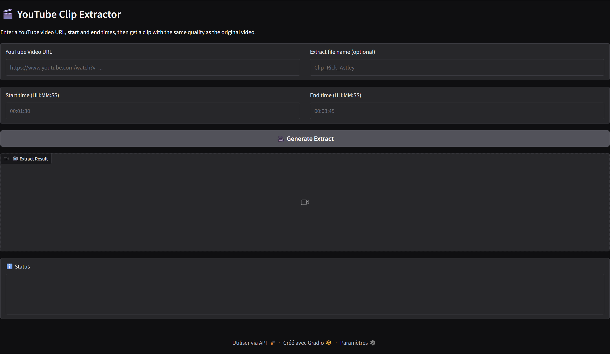

<div align="center">
  <h1>🎞️ YouTube Clip Extractor</h1>
  
  <h4>⚠️ This repository has been archived and is no longer maintained. ⚠️</h4>
</div>

[](https://www.python.org/downloads/)
[](https://gradio.app/)
[](LICENSE)

---

# 🇬🇧 English Version

A powerful web application to extract clips from YouTube videos with high quality. Available in both English and French.

### 🚀 Quick Start

#### Prerequisites
- Python 3.8 or higher
- FFmpeg (for video processing)

#### Installation
1. **Clone the repository**
   ```bash
   git clone https://github.com/Erazor48/youtube-clip-extractor.git
   cd youtube-clip-extractor
   ```
2. **Install dependencies**
   ```bash
   pip install -r requirements.txt
   ```
3. **Install FFmpeg** (if not already installed)
   - [FFmpeg download page](https://ffmpeg.org/download.html)

#### Usage
- **English (online or local)** :
  ```bash
  python app_en.py
  ```
- **Terminal launcher** :
  ```bash
  python launch.py
  ```

#### Features
- Extract high quality clips from YouTube videos
- Bilingual interface (English & French)
- Simple Gradio web UI
- Custom time range and file naming
- No video files or outputs are stored in the repository

#### Project Structure
```
Get_Video/
├── app_en.py           # English Gradio interface (online & local)
├── app_fr.py           # French Gradio interface (local)
├── video_utils.py      # Video processing utilities
├── requirements.txt    # Python dependencies
├── README.md           # This file
├── LICENSE             # MIT License
├── .gitignore          # Ignore rules
├── launch.py           # Terminal language launcher (optional)
├── downloads/          # Downloaded videos (ignored)
└── outputs/            # Generated clips (ignored)
```

#### .gitignore
- `downloads/` and `outputs/` are ignored (not on GitHub)
- `.gradio/` and all temp/cache files are ignored
- Only code, documentation, and requirements are versioned

#### License
MIT License - see [LICENSE](LICENSE)

#### Disclaimer
This tool is for educational and personal use only. Please respect YouTube's Terms of Service and copyright laws. Only download videos you have permission to use.

---

# 🇫🇷 Version Française

Une application web puissante pour extraire des clips de vidéos YouTube avec une qualité élevée. Disponible en anglais et français.

### 🚀 Démarrage rapide

#### Prérequis
- Python 3.8 ou supérieur
- FFmpeg (pour le traitement vidéo)

#### Installation
1. **Cloner le repository**
   ```bash
   git clone https://github.com/Erazor48/youtube-clip-extractor.git
   cd youtube-clip-extractor
   ```
2. **Installer les dépendances**
   ```bash
   pip install -r requirements.txt
   ```
3. **Installer FFmpeg** (si pas déjà installé)
   - [Page de téléchargement FFmpeg](https://ffmpeg.org/download.html)

#### Utilisation
- **Version française (local uniquement)** :
  ```bash
  python app_fr.py
  ```
- **Lanceur terminal** :
  ```bash
  python launch.py
  ```

#### Fonctionnalités
- Extraction haute qualité de clips YouTube
- Interface bilingue (anglais & français)
- Interface web simple avec Gradio
- Plage de temps et nommage personnalisés
- Aucun fichier vidéo ou extrait n'est stocké dans le dépôt

#### Structure du projet
```
Get_Video/
├── app_en.py           # Interface anglaise Gradio (en ligne & local)
├── app_fr.py           # Interface française Gradio (local)
├── video_utils.py      # Utilitaires de traitement vidéo
├── requirements.txt    # Dépendances Python
├── README.md           # Ce fichier
├── LICENSE             # Licence MIT
├── .gitignore          # Règles d'exclusion
├── launch.py           # Lanceur de langue terminal (optionnel)
├── downloads/          # Vidéos téléchargées (ignoré)
└── outputs/            # Clips générés (ignoré)
```

#### .gitignore
- `downloads/` et `outputs/` sont ignorés (non versionnés)
- `.gradio/` et tous les fichiers temporaires/cache sont ignorés
- Seul le code, la documentation et les dépendances sont versionnés

#### Licence
Licence MIT - voir [LICENSE](LICENSE)

#### Avertissement
Cet outil est destiné à un usage éducatif et personnel uniquement. Veuillez respecter les Conditions d'Utilisation de YouTube et les lois sur les droits d'auteur. Ne téléchargez que les vidéos pour lesquelles vous avez l'autorisation d'utilisation.

---

## 🌍 Liens
- [Démo Hugging Face (Anglais)](https://huggingface.co/spaces/Erazor48/youtube-clip-extractor)
- [Dépôt GitHub](https://github.com/Erazor48/youtube-clip-extractor)

## 🌟 Features

- **High Quality Extraction**: Maintains original video quality
- **Bilingual Support**: Available in English and French
- **User-Friendly**: Simple web interface with Gradio
- **Flexible Time Format**: Supports HH:MM:SS time format
- **Custom Naming**: Optional custom file naming
- **Automatic Download**: Downloads videos automatically from YouTube

## 🚀 Quick Start

### Prerequisites

- Python 3.8 or higher
- FFmpeg (for video processing)

### Installation

1. **Clone the repository**
   ```bash
   git clone https://github.com/Erazor48/youtube-clip-extractor.git
   cd youtube-clip-extractor
   ```

2. **Install dependencies**
   ```bash
   pip install -r requirements.txt
   ```

3. **Install FFmpeg** (if not already installed)
   
   **Windows:**
   ```bash
   # Using chocolatey
   choco install ffmpeg
   
   # Or download from https://ffmpeg.org/download.html
   ```
   
   **macOS:**
   ```bash
   brew install ffmpeg
   ```
   
   **Linux:**
   ```bash
   sudo apt update
   sudo apt install ffmpeg
   ```

4. **Launch the application**
   
   **Option 1: Interactive launcher (recommended)**
   ```bash
   python launch.py
   ```
   
   **Option 2: Direct launch**
   ```bash
   # English version
   python app_en.py
   
   # French version
   python app_fr.py
   ```

5. **Open your browser** and go to `http://localhost:7860`

## 📖 Usage

1. **Enter YouTube URL**: Paste the URL of the video you want to extract from
2. **Set Time Range**: 
   - Start time in HH:MM:SS format (e.g., 00:01:30)
   - End time in HH:MM:SS format (e.g., 00:03:45)
3. **Optional**: Enter a custom name for your clip
4. **Click "Generate Extract"**: The application will download the video and create your clip

## 📁 Project Structure

```
youtube-clip-extractor/
├── app_en.py           # English version
├── app_fr.py           # French version
├── launch.py           # Interactive language launcher
├── video_utils.py      # Video processing utilities
├── requirements.txt    # Python dependencies
├── .gitignore         # Git ignore rules
├── README.md          # This file
├── LICENSE            # MIT License
├── downloads/         # Downloaded videos (auto-created)
└── outputs/           # Generated clips (auto-created)
```

## 🌐 Language Support

The application is available in two languages:

### 🇺🇸 English Version (`app_en.py`)
- Complete English interface
- English error messages and status updates
- English documentation and placeholders

### 🇫🇷 French Version (`app_fr.py`)
- Complete French interface
- French error messages and status updates
- French documentation and placeholders

### 🚀 Easy Launch
Use `python launch.py` for an interactive language selection menu.

## 🔧 Configuration

The application automatically creates the following directories:
- `downloads/`: Stores downloaded YouTube videos
- `outputs/`: Stores generated video clips

## 📋 Requirements

- `yt-dlp>=2023.12.30`: YouTube video downloading
- `moviepy>=1.0.3`: Video processing and editing
- `gradio>=4.0.0`: Web interface framework

## 🤝 Contributing

1. Fork the repository
2. Create a feature branch (`git checkout -b feature/AmazingFeature`)
3. Commit your changes (`git commit -m 'Add some AmazingFeature'`)
4. Push to the branch (`git push origin feature/AmazingFeature`)
5. Open a Pull Request

## 📄 License

This project is licensed under the MIT License - see the [LICENSE](LICENSE) file for details.

## ⚠️ Disclaimer

This tool is for educational and personal use only. Please respect YouTube's Terms of Service and copyright laws. Only download videos you have permission to use.

## 🐛 Troubleshooting

### Common Issues

1. **FFmpeg not found**: Make sure FFmpeg is installed and in your system PATH
2. **Download errors**: Check your internet connection and the YouTube URL
3. **Memory issues**: Large videos may require more RAM

### Getting Help

If you encounter any issues, please:
1. Check the console output for error messages
2. Ensure all dependencies are installed correctly
3. Verify FFmpeg is properly installed
4. Open an issue on GitHub with detailed error information

---

---

# 🎞️ Extracteur de Clip YouTube

[](https://www.python.org/downloads/)
[](https://gradio.app/)
[](LICENSE)

Une application web puissante pour extraire des clips de vidéos YouTube avec une qualité élevée. Disponible en anglais et français.

## 🌟 Fonctionnalités

- **Extraction Haute Qualité**: Maintient la qualité originale de la vidéo
- **Support Bilingue**: Disponible en anglais et français
- **Interface Simple**: Interface web intuitive avec Gradio
- **Format de Temps Flexible**: Supporte le format HH:MM:SS
- **Nommage Personnalisé**: Nommage de fichier optionnel
- **Téléchargement Automatique**: Télécharge automatiquement les vidéos YouTube

## 🚀 Démarrage Rapide

### Prérequis

- Python 3.8 ou supérieur
- FFmpeg (pour le traitement vidéo)

### Installation

1. **Cloner le repository**
   ```bash
   git clone https://github.com/Erazor48/youtube-clip-extractor.git
   cd youtube-clip-extractor
   ```

2. **Installer les dépendances**
   ```bash
   pip install -r requirements.txt
   ```

3. **Installer FFmpeg** (si pas déjà installé)
   
   **Windows:**
   ```bash
   # Avec chocolatey
   choco install ffmpeg
   
   # Ou télécharger depuis https://ffmpeg.org/download.html
   ```
   
   **macOS:**
   ```bash
   brew install ffmpeg
   ```
   
   **Linux:**
   ```bash
   sudo apt update
   sudo apt install ffmpeg
   ```

4. **Lancer l'application**
   
   **Option 1: Lanceur interactif (recommandé)**
   ```bash
   python launch.py
   ```
   
   **Option 2: Lancement direct**
   ```bash
   # Version anglaise
   python app_en.py
   
   # Version française
   python app_fr.py
   ```

5. **Ouvrir votre navigateur** et aller sur `http://localhost:7860`

## 📖 Utilisation

1. **Entrer l'URL YouTube**: Collez l'URL de la vidéo dont vous voulez extraire un clip
2. **Définir la Plage Temporelle**: 
   - Heure de début au format HH:MM:SS (ex: 00:01:30)
   - Heure de fin au format HH:MM:SS (ex: 00:03:45)
3. **Optionnel**: Entrez un nom personnalisé pour votre clip
4. **Cliquer "Générer l'extrait"**: L'application téléchargera la vidéo et créera votre clip

## 📁 Structure du Projet

```
youtube-clip-extractor/
├── app_en.py           # Version anglaise
├── app_fr.py           # Version française
├── launch.py           # Lanceur interactif de langue
├── video_utils.py      # Utilitaires de traitement vidéo
├── requirements.txt    # Dépendances Python
├── .gitignore         # Règles Git ignore
├── README.md          # Ce fichier
├── LICENSE            # Licence MIT
├── downloads/         # Vidéos téléchargées (créé automatiquement)
└── outputs/           # Clips générés (créé automatiquement)
```

## 🌐 Support Linguistique

L'application est disponible en deux langues :

### 🇺🇸 Version Anglaise (`app_en.py`)
- Interface complète en anglais
- Messages d'erreur et statuts en anglais
- Documentation et placeholders en anglais

### 🇫🇷 Version Française (`app_fr.py`)
- Interface complète en français
- Messages d'erreur et statuts en français
- Documentation et placeholders en français

### 🚀 Lancement Facile
Utilisez `python launch.py` pour un menu de sélection de langue interactif.

## 🔧 Configuration

L'application crée automatiquement les répertoires suivants :
- `downloads/`: Stocke les vidéos YouTube téléchargées
- `outputs/`: Stocke les clips vidéo générés

## 📋 Exigences

- `yt-dlp>=2023.12.30`: Téléchargement de vidéos YouTube
- `moviepy>=1.0.3`: Traitement et édition vidéo
- `gradio>=4.0.0`: Framework d'interface web

## 🤝 Contribution

1. Fork le repository
2. Créez une branche de fonctionnalité (`git checkout -b feature/NouvelleFonctionnalite`)
3. Committez vos changements (`git commit -m 'Ajouter une nouvelle fonctionnalité'`)
4. Poussez vers la branche (`git push origin feature/NouvelleFonctionnalite`)
5. Ouvrez une Pull Request

## 📄 Licence

Ce projet est sous licence MIT - voir le fichier [LICENSE](LICENSE) pour plus de détails.

## ⚠️ Avertissement

Cet outil est destiné à un usage éducatif et personnel uniquement. Veuillez respecter les Conditions d'Utilisation de YouTube et les lois sur les droits d'auteur. Ne téléchargez que les vidéos pour lesquelles vous avez l'autorisation d'utilisation.

## 🐛 Dépannage

### Problèmes Courants

1. **FFmpeg non trouvé**: Assurez-vous que FFmpeg est installé et dans votre PATH système
2. **Erreurs de téléchargement**: Vérifiez votre connexion internet et l'URL YouTube
3. **Problèmes de mémoire**: Les grandes vidéos peuvent nécessiter plus de RAM

### Obtenir de l'Aide

Si vous rencontrez des problèmes, veuillez :
1. Vérifier la sortie console pour les messages d'erreur
2. S'assurer que toutes les dépendances sont installées correctement
3. Vérifier que FFmpeg est correctement installé
4. Ouvrir un issue sur GitHub avec des informations d'erreur détaillées 